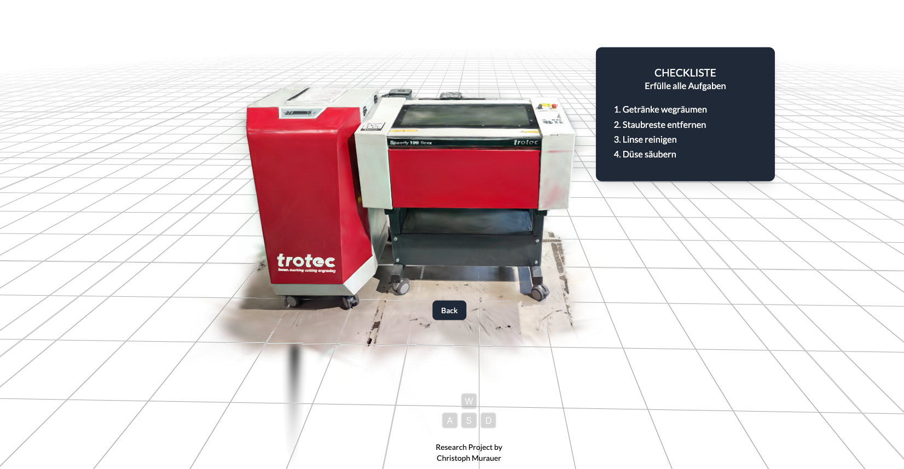

# 3D Gaussian Splatting Master Thesis

## Description
A simple portfolio web app created with React Three fiber. Includes Monitoring and Debug UI.
Based on the lesson **React Three Fiber** and **Drei** from [Three.js Journey](https://threejs-journey.com/lessons/r3f-drei).

## Tech Stack

| Technologie                                                       | Version | Description                                        |
|-------------------------------------------------------------------|---------|----------------------------------------------------|
| [three](https://threejs.org/)                                     | 0.158.0 | Graphic Javascript Framework based on JS API WebGL |
| [@react-three/fiber](https://github.com/pmndrs/react-three-fiber) | 8.15    | react-three-fiber is a React renderer for threejs  |
| [@react-three/drei](https://github.com/pmndrs/drei)               | 9.88    | Graphic Javascript Framework based on JS API WebGL |
| [leva](https://github.com/pmndrs/leva)                            | 0.9     | A Debug UI package                                 |
| [R3F-Perf](https://www.npmjs.com/package/r3f-perf)                            | 0.9     | Monitoring Tool for R3F                            |
| [VITE](https://vitejs.dev/)                                       | 5.1.6   | Fast Frontend Building Tool                        |


## Run

```
npm install
npm run dev
```

## License
[MIT licensed](LICENSE)